# Xcaciv.Command Architecture Diagram

## Class Structure UML

## Detailed Class Relationships

```mermaid
classDiagram
    class CommandController {
        -ICommandRegistry _commandRegistry
        -ICommandLoader _commandLoader
        -IPipelineExecutor _pipelineExecutor
        -ICommandExecutor _commandExecutor
        -ICommandFactory _commandFactory
        -IAuditLogger _auditLogger
        -IOutputEncoder _outputEncoder
        -string _helpCommand
        +AddPackageDirectory(string)
        +LoadCommands(string)
        +EnableDefaultCommands()
        +AddCommand(string, ICommandDelegate, bool)
        +AddCommand(string, Type, bool)
        +AddCommand(ICommandDescription)
        +Run(string, IIoContext, IEnvironmentContext)*
        +GetHelp(string, IIoContext, IEnvironmentContext)
    }

    class CommandRegistry {
        -Dictionary~string, ICommandDescription~ _commands
        +AddCommand(ICommandDescription)
        +AddCommand(string, Type, bool)
        +AddCommand(string, ICommandDelegate, bool)
        +TryGetCommand(string, ICommandDescription)*
        +GetAllCommands() IEnumerable~ICommandDescription~
    }

    class CommandLoader {
        -ICrawler _crawler
        -IVerifiedSourceDirectories _verifiedDirectories
        +AddPackageDirectory(string)
        +SetRestrictedDirectory(string)
        +LoadCommands(string, Action~ICommandDescription~)
    }

    class PipelineExecutor {
        -PipelineConfiguration Configuration
        +ExecuteAsync(string, IIoContext, IEnvironmentContext, Func)*
    }

    class CommandExecutor {
        -ICommandRegistry _registry
        -ICommandFactory _commandFactory
        -IAuditLogger _auditLogger
        +ExecuteAsync(string, IIoContext, IEnvironmentContext)*
        +GetHelpAsync(string, IIoContext, IEnvironmentContext)*
    }

    class CommandFactory {
        -IServiceProvider _serviceProvider
        +CreateCommand(ICommandDescription, IIoContext) ICommandDelegate
        +CreateCommand(string, string) ICommandDelegate
    }

    class ICommandRegistry {
        <<interface>>
        +AddCommand(ICommandDescription)*
        +AddCommand(string, Type, bool)*
        +AddCommand(string, ICommandDelegate, bool)*
        +TryGetCommand(string, ICommandDescription)*
        +GetAllCommands() IEnumerable~ICommandDescription~*
    }

    class ICommandLoader {
        <<interface>>
        +Directories IReadOnlyList~string~*
        +AddPackageDirectory(string)*
        +SetRestrictedDirectory(string)*
        +LoadCommands(string, Action~ICommandDescription~)*
    }

    class IPipelineExecutor {
        <<interface>>
        +Configuration PipelineConfiguration*
        +ExecuteAsync(string, IIoContext, IEnvironmentContext, Func)*
    }

    class ICommandExecutor {
        <<interface>>
        +HelpCommand string*
        +AuditLogger IAuditLogger*
        +ExecuteAsync(string, IIoContext, IEnvironmentContext)*
        +GetHelpAsync(string, IIoContext, IEnvironmentContext)*
    }

    class ICommandFactory {
        <<interface>>
        +CreateCommand(ICommandDescription, IIoContext) ICommandDelegate*
        +CreateCommand(string, string) ICommandDelegate*
    }

    class ICommandDelegate {
        <<interface>>
        +HandleExecution(IIoContext, IEnvironmentContext) IAsyncEnumerable~CommandResult~*
        +HandlePipedChunk(CommandResult) IAsyncEnumerable~CommandResult~*
        +DisposeAsync() ValueTask*
    }

    class ICommandDescription {
        <<interface>>
        +BaseCommand string*
        +SubCommands Dictionary~string, ICommandDescription~*
        +FullTypeName string*
        +ModifiesEnvironment bool*
        +PackageDescription PackageDescription*
    }

    class IIoContext {
        <<interface>>
        +HasPipedInput bool*
        +Parameters string[]*
        +SetParameters(string[]) Task*
        +WriteOutput(string) Task*
        +AddTraceMessage(string, string) Task*
    }

    class IEnvironmentContext {
        <<interface>>
        +GetVariable(string) string*
        +SetVariable(string, string) Task*
    }

    class EnvironmentContext {
        -Dictionary~string, string~ _variables
        +GetVariable(string) string
        +SetVariable(string, string) Task
    }

    class IAuditLogger {
        <<interface>>
        +LogCommandExecution(string, string[], string) Task*
        +LogEnvironmentChange(string, string, string) Task*
    }

    class IOutputEncoder {
        <<interface>>
        +Encode(string) string*
    }

    class NoOpAuditLogger {
        +LogCommandExecution(string, string[], string) Task
        +LogEnvironmentChange(string, string, string) Task
    }

    class NoOpEncoder {
        +Encode(string) string
    }

    class PipelineConfiguration {
        +MaxBufferSize int
        +Timeout TimeSpan
    }

    CommandController --> ICommandRegistry
    CommandController --> ICommandLoader
    CommandController --> IPipelineExecutor
    CommandController --> ICommandExecutor
    CommandController --> ICommandFactory
    CommandController --> IIoContext
    CommandController --> IEnvironmentContext
    CommandController --> IAuditLogger
    CommandController --> IOutputEncoder

    CommandRegistry ..|> ICommandRegistry
    CommandLoader ..|> ICommandLoader
    PipelineExecutor ..|> IPipelineExecutor
    CommandExecutor ..|> ICommandExecutor
    CommandFactory ..|> ICommandFactory

    CommandExecutor --> ICommandRegistry
    CommandExecutor --> ICommandFactory
    CommandExecutor --> IAuditLogger

    CommandFactory --> ICommandDelegate

    EnvironmentContext ..|> IEnvironmentContext

    NoOpAuditLogger ..|> IAuditLogger
    NoOpEncoder ..|> IOutputEncoder

    PipelineConfiguration --> CommandController
```

## Component Interaction Flow

## Key Design Patterns

### 1. **Dependency Injection**
- All major components accept interfaces through constructor injection
- Supports testing with mock implementations
- CommandController provides default implementations when not supplied

### 2. **Strategy Pattern**
- `ICommandLoader` - Different strategies for discovering commands
- `IPipelineExecutor` - Pipeline execution strategy
- `ICommandFactory` - Command instantiation strategy

### 3. **Factory Pattern**
- `CommandFactory` - Creates command instances
- Supports both direct instantiation and dependency injection resolution

### 4. **Registry Pattern**
- `CommandRegistry` - Centralized command lookup and registration

### 5. **Observer/Audit Pattern**
- `IAuditLogger` - Tracks command execution and environment changes
- `NoOpAuditLogger` - Default no-operation implementation

### 6. **Pipeline Pattern**
- Commands connected via channels for streaming data
- `IIoContext` manages bounded channels for backpressure control

## Component Responsibilities

| Component | Responsibility |
|-----------|-----------------|
| **CommandController** | Orchestration, routing, entry point |
| **CommandRegistry** | Command storage and lookup |
| **CommandLoader** | Plugin discovery from file system |
| **CommandExecutor** | Command instantiation and execution lifecycle |
| **CommandFactory** | Instance creation with DI support |
| **PipelineExecutor** | Multi-stage pipeline coordination |
| **EnvironmentContext** | Environment variable isolation |
| **IAuditLogger** | Security audit trail logging |

## Security Boundaries

1. **Plugin Loading** - Verified directories only via `IVerifiedSourceDirectories`
2. **Environment Mutation** - Only commands with `ModifiesEnvironment=true` can modify
3. **Assembly Loading** - Dynamic loading through `AssemblyContext` with path restrictions
4. **Input Validation** - Framework validates parameters before command execution
5. **Audit Logging** - All security-relevant operations logged via `IAuditLogger`
